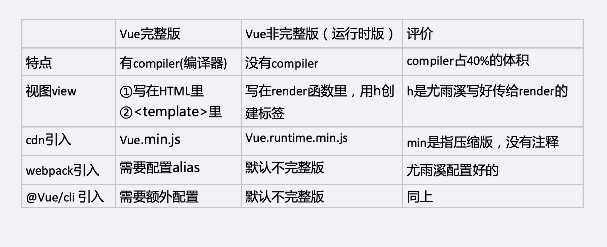

# 浅析 Vue 两个版本的区别和使用方法
## 一、两个版本对应的文件名


## 二、template 和 render 怎么用
1. Vue 完整版 `<template>`的使用方法，写在 `html`页面里或者`js`里
```vue
<template>
  <div id="app">
  {{n}}
    <button @click="add">+1</button>
  </div>
</template>
```

2. `render`在非完整版里的使用
```js
render(h){ 
     return h('div', [this.n,h（'{on:{click:this.add}’,'+1'])
 } //h相当于 creatElement,用h去创建实例
```
3. 还有一种方法：Vue单文件组件
   是把`<template>`,·`<script>`,`<style>`都写在`Xxx.vue`文件里，vue-loader 会自动将其转成对象，之后我们在js文件里`import`,并且` new Vue()` 将其实例化
   ```js
   new Vue({
        el:'#app',
        render(h){
         return h(Xxx)
        }
    })
   ```

#### 建议
  使用非完整版，配合Vue-loader,就是Vue单文件组件
  ##### 优点
  * 利于用户体验，用户下载的js文件小，但只支持h函数
  * 利于开发体验，在vue文件里写html标签，不写h函数
  * 麻烦事让loader做，vue-loader把vue文件里的html转化为h函数
  
## 三、教读者如何用 `codesandbox.io` 写 Vue 代码
进入网站首页 ⇒ 点击create(不要登录) ⇒ 选择Vue ⇒ 自动生成相关文件，直接用