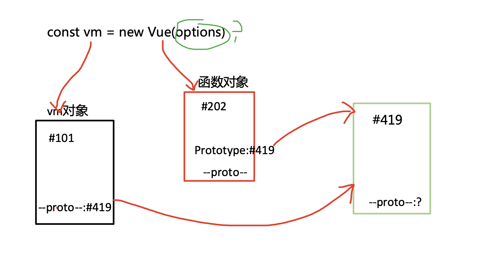
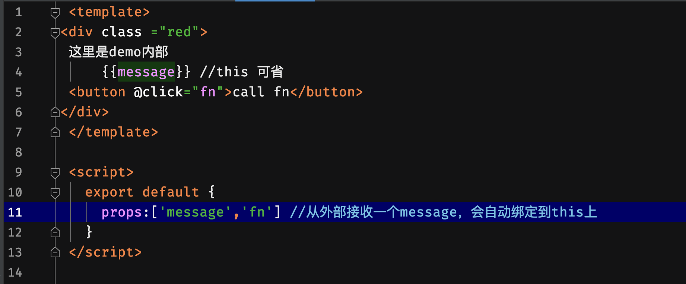
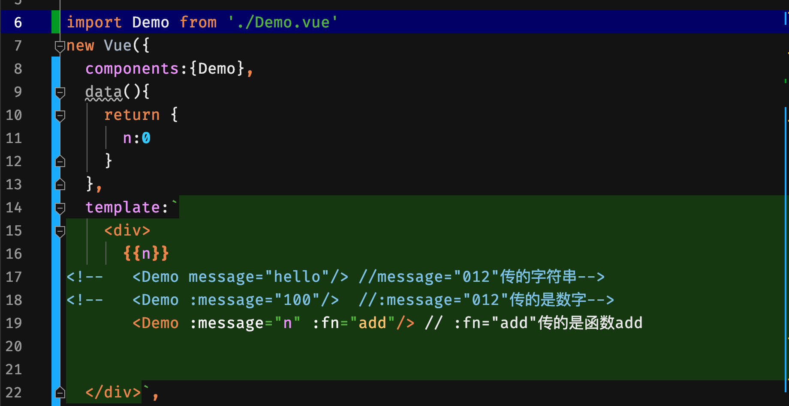

# Vue 构造选项(一)
## 一、Vue实例

### 总结
  * 把 Vue 的实例命名为vm是尤雨溪的习惯，我们应该沿用
  * vm 对象封装了对视图的所有操作，包括数据读写、事件绑定、DOM更新
  * vm 的构造函数是Vue，按照ES6的说法，vm所属的类是Vue
  * option是new Vue的参数，一般称之为选项和构造选项
  
## 二、参数 option 里有什么
### 有五类属性
  #### 1. 数据：data、props(外部属性)、computed、methods、watch
  #### 2. DOM：el（用模板替换页面哪一块，容器）
  * template(html 内容)完整版
  * render(渲染) 非完整版
  * 二选一
  #### 3. 生命周期钩子
  1. beforeCreate(生之前)、created(生之后)
  2. beforeMount(挂之前)、mounted(挂之后)
  3. beforeUpdate(更新之前)、updated(更新之后)
  4. activated、 deactivated
  5. beforeDestroy(死之前)、destroyed(死之后)
  #### 4. 资源
   1. directives(指令)
   2. filters（过滤）
   3. components(组件) 
  #### 5. 组合
    1. parent
    2. mixins(混入)
    3. extends(扩展)
    4. provide(提供)
    5. inject（注入）
## 三、vue组件data为什么必须是函数
```js
new  Vue({
    el: '#app',
    template: `<div>{{demo}}</div>`,
    data: {
        demo: 123
    }
})
```
在 new Vue中，data写成对象和函数都可以，再组件中，为什么data一定是函数
```js
const Component = function() {};
Component.prototype.data = {
    demo: 123
}
var component1 = new Component();
var component2 = new Component();
component1.data.demo = 456;
console.log(component2.data.demo); // 456
```
#### 解释
* `component1`和`component2`都引用同一个对象，`component1`变成456，那么`component2`也变成456。
* 组件的实例化，引用同一对象，如果data是对象，一旦修改其中一个组件数据，另一个也跟着变。
* 但是如果data是函数，Vue组件的data因为是函数有了作用域，互不干扰。
## 四、外部属性（props）

