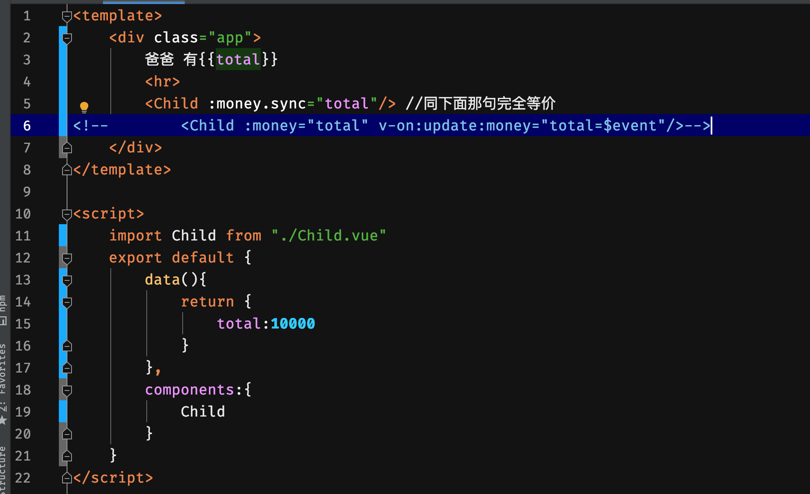

# Vue 中的 .sync 修饰符
## 一、什么是修饰符
#### 有些指令支持修饰符
* `@click.stop="add"` 表示阻止事件传播/冒泡
* `@click.prevent="add"` 表示阻止默认动作
* `@keyPress.enter="xxx"` 表示按下回车键，就执行xxx
* `@click.stop.prevent="add"` 同时表示两种意思
  
## 二、`.sync` 修饰符
#### 代码示例

###### 子组件


##### 注意
1. vue组件不可以修改props 外部属性
2. `$emit` 可以触发事件，并传参
3. `$event` 可以获取 `$emit` 的参数
##### 因为这样用的场景很多，所以Vue作者发明了 `.sync` 修饰符
```vue
<Child :money.sync="total"/> 
//等价于
 <Child :money="total" v-on:update:money="total=$event"/>
```