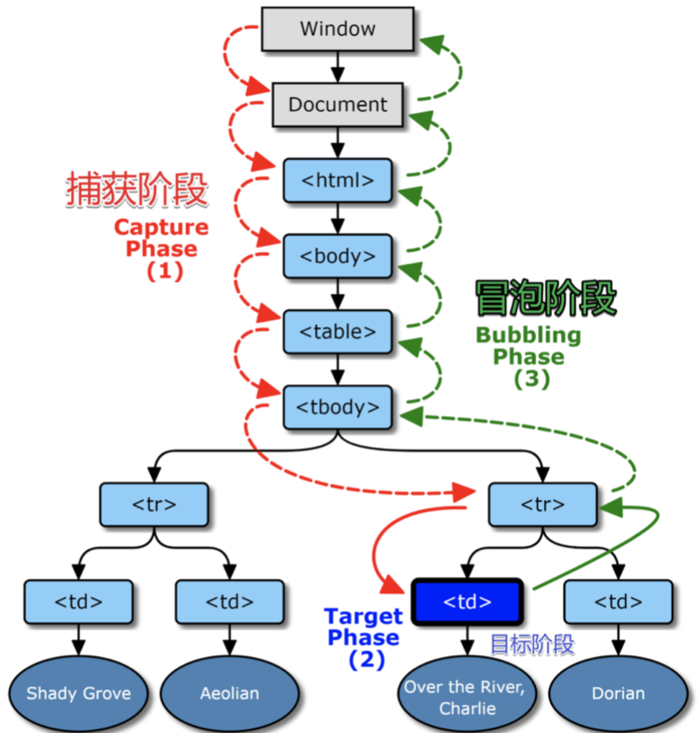

# 简述 DOM 事件模型或 DOM 事件机制
简述 DOM 事件模型或 DOM 事件机制
请描述什么是捕获什么是冒泡，并说说是先捕获还是先冒泡，再搜搜看网上的文章怎么说

## 捕获
```html
<div class='爷爷'>
    <div class='爸爸'>
        <div class='儿子'></div>
    </div>
</div>
```
捕获从 爷爷 => 爸爸 => 儿子 看有没有函数监听
## 冒泡
冒泡从 儿子 => 爸爸 => 爷爷 看有没有函数监听

## 捕获与冒泡
W3C标准
首先 捕获 ，再冒泡


## 事件绑定 API addEventListener
W3C: 
 `baba.addEventListener('click',fn,bool)`
1. 如果不传bool值 默认为false，走冒泡
2. 如果 bool 值为 true， 走捕获

## target 与 currentTarget 区别
`e.target` 用户操作的元素
`e.currentTarget` 程序员监听的元素

##### 举例
```html
<div>
    <span>你好</span>
</div>
```
当用户点击文字‘你好’，`e.target` 是 span
`e.currentTarget` 就是 div

## 取消冒泡
 捕获不能取消，冒泡可以
 `e.stopPropagation` 中断冒泡