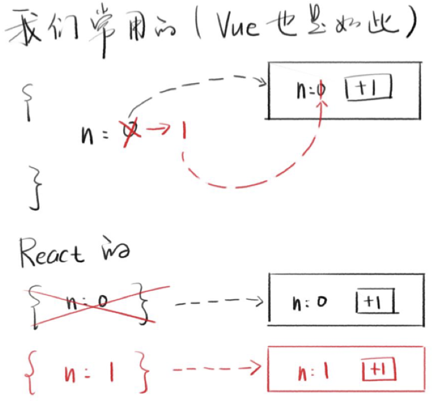

# React 组件
## 组件
元素与组件
```js
const div = React.createElement('div',...) //元素
const Div = ()=> React.createElement('div',...) //组件
```
* 在React里，一个返回React元素的函数就是组件
* 在vue里，一个构造选项就是组件
  
### React 类组件 & 函数组件
类组件
```js
class Welcome extends React.Component {
  render() {
return <h1>Hello, {this.props.name}</h1> }
}
 <Welcome name="frank"/>
```

函数组件
```js
function Welcome(props){
  return <h1>Hello, {props.name}</h1>;
}

<Welcome name="frank"/>
```
## 添加 Props (外部数据)
1. 类组件直接读取属性`this.props.name`
2. 函数组件直接读取参数 `props.name`
   
## 添加 state (内部数据)
### 类组件
类组件使用 `this.state`读，`this.setState`写
#### 注意事项
##### 1. `this.state.n += 1` 有效果吗？
   n 已经改变了，只不过 UI 不自动更新，需要调用 `setState` 才会触发更新（异步更新），因为 React 没有像 Vue 监听data 那样去监听 state
##### 2. `setState` 会异步更新UI
setState 之后，state 不会马上变，如果立马读 state 会失败
更推荐的方式是 使用 setState(函数)来对state进行更改
##### 3. `this.setState(this.state)` 为什么不推荐使用
React 希望我们不要修改旧的state（不可变数据原则）
常用示例代码：`setState({n: state.n + 1})` 

### 函数组件
#### 和类组件相似的地方
也需要通过 setN (新值) 来更新UI 
#### 和类组件不一样的地方
没有this，一律用参数和变量

### React的编程模型
1. 旧的对象对应一个虚拟DOM，新的对象对应一个虚拟DOM
2. 对比两个虚拟DOM找不同，最后局部更新DOM
### 遇到复杂state，数据变多个
类组件的setState会自动合并第一层属性，也就是基本数据类型，遇到对象这种复杂类型就不行
```js
class Son extends React.Component {
  constructor() {
    super();
    this.state = {
      n: 0,
      m: 0
    };
  }
  addN() {
    this.setState({ n: this.state.n + 1 });
    // m 会被覆盖为 undefined 吗？
  }
  addM() {
    this.setState({ m: this.state.m + 1 });
    // n 会被覆盖为 undefined 吗？
  }
  render() {
    return (
      <div className="Son">
        儿子 n: {this.state.n}
        <button onClick={() => this.addN()}>n+1</button>
        m: {this.state.m}
        <button onClick={() => this.addM()}>m+1</button>
        <Grandson />
      </div>
    );
  }
}
```
函数组件的setN完全不帮你合并，要合并自己用 ...操作符合并
```js
const Grandson = () => {
  const [n, setN] = React.useState(0);
  const [m, setM] = React.useState(0);
  return (
    <div className="Grandson">
      孙子 n:{n}
      <button onClick={() => setN(n + 1)}>n+1</button>
      m:{m}
      <button onClick={() => setM(m + 1)}>m+1</button>
    </div>
  );
};
```
## 事件绑定
类组件事件绑定的最终写法
```js
class Son extends React.Component{
    addN = () => this.setState({n: this.state.n + 1}); 
    render(){
        return <button onClick={this.addN}>n+1</button> }
    }
```

## React 和 Vue
### 相同点
* 都是对视图的封装，React是用类和函数表示组件，而Vue是通过构造选项构造一个组件
* 都提供了将`createElement`的 XML 简写，React提供的是JSX 语法，而vue提供的是模版语法
  
### 不同点
* React 把HTML放在JS里写（HTML in JS）
* Vue 把JS放在HTML里写 （JS in HTML）