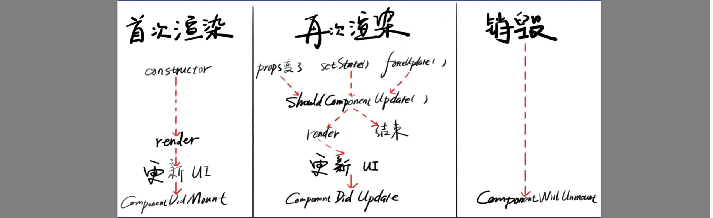

# React class 组件
```js
class B extends React.Component {
  constructor(props) {
    super(props); 
    }
  render() {
    return (
        <div>hi</div> 
    )}
}
export default B;
```
## 读取 props
```js
class B extends React.Component { constructor(props) {
    super(props);
  }
    render(){
        return <div onClick={this.props.onClick}> 
            {this.props.name}
        <div>
        {this.props.children} 
        </div>
    </div>
} }
//this.props.xxx
  
```

### props 的作用
#### 1.接收外部数据
只能读不能写，外部数据由父组件传递
#### 2. 接收外部函数
在恰当的时机，调用该函数，这个函数一般是父组件的函数
## state & setState
```js
class B extends React.Component{
 constructor(props) { 
     super(props); 
     this.state = {
        user: {name:'frank', age:18}
  }
}
  render() { /* ... */ }
}
```

## 生命周期
### constructor
用途：初始化props、state
### shouldComponentUpdate
用途：
1. 返回true 表示不阻止UI更新
2. 返回false 表示阻止UI更新
面试：
它允许我们手动判断是否要进行UI更新，我们可以根据需求来设置返回值。
### render
展示视图
```js
return (<div>...</div>)
```
1. 可以写条件判断，？ ： 表达式
2. 不能直接for循环，推荐用数组，可以`array.map`
### componentDidMount()
用途：
1. 在元素插入页面后执行代码，这些代码依赖DOM
2. 比如获取div的高度，最好写在这里
3. 这里可以发起加载数据的AJAX请求
4. 首次渲染会执行这个钩子
### componentDidUpdate()
用途：
1. 在视图更新后执行此代码
2. 此处也可以AJAX 请求，用于更新数据
3. 首次渲染不回执行这个钩子
4. 如果shouldComponentUpdate返回false，不会触发该钩子
### componentWillUnmount
用途：
1. 组件将要被移出页面然后被销毁时执行代码
2. Unmount过的组件不会在mount

## 生命周期总结
1. constructor() 在这里初始化 state
2. shouldComponentUpdate() return false 阻止更新
3. render() 创建虚拟DOM
4. componentDidMount() 组件已经出现在页面
5. componentDidUpdate() 组件已更新
6. componentWillUnmount() 组件将死
