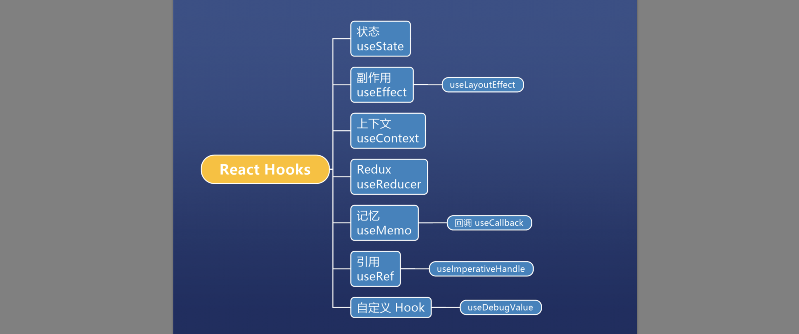

# React Hooks



## useState
```js 
const [n,setN] = React.useState(0)
```
### 注意
1. 不可局部更新,setState不会自动合并属性
2. 地址不变 如果setState(obj)，obj的地址不变，react认为数据没有变化
## useReducer
用法分四步
1. 创建初始值 `initialState`
2. 创建所有操作 `reducer(state, action)`
3. 传给`useReducer`,得到读写API
4. 调用写({type:'操作类型'})
useReducer是 useState 的复杂版
::: details 示例代码
```js
import React, { useState, useReducer } from "react";
import ReactDOM from "react-dom";

const initial = {
  n: 0
};

const reducer = (state, action) => {
  if (action.type === "add") {
    return { n: state.n + action.number };
  } else if (action.type === "multi") {
    return { n: state.n * 2 };
  } else {
    throw new Error("unknown type");
  }
};

function App() {
  const [state, dispatch] = useReducer(reducer, initial);
  const { n } = state;
  const onClick = () => {
    dispatch({ type: "add", number: 1 });
  };
  const onClick2 = () => {
    dispatch({ type: "add", number: 2 });
  };
  return (
    <div className="App">
      <h1>n: {n}</h1>

      <button onClick={onClick}>+1</button>
      <button onClick={onClick2}>+2</button>
    </div>
  );
}

const rootElement = document.getElementById("root");
ReactDOM.render(<App />, rootElement);

```
:::

### 如何代替 `Redux`
使用步骤：
1. 将所有数据集中到一个 store 对象
2. 将所有操作集中在 reducer
3. 创建一个 Context
4. 创建对数据的读写API
5. 将第四步的内容放到第三步的 Context
6. 用 `Context.Provider` 将 `context` 提供给所有组件
7. 各个组件用 `useContext` 来获取读写API
::: details 示例代码
```js
import React, { useReducer, useContext, useEffect } from "react";
import ReactDOM from "react-dom";

const store = {
  user: null,
  books: null,
  movies: null
};

function reducer(state, action) {
  switch (action.type) {
    case "setUser":
      return { ...state, user: action.user };
    case "setBooks":
      return { ...state, books: action.books };
    case "setMovies":
      return { ...state, movies: action.movies };
    default:
      throw new Error();
  }
}

const Context = React.createContext(null);

function App() {
  const [state, dispatch] = useReducer(reducer, store);

  const api = { state, dispatch };
  return (
    <Context.Provider value={api}>
      <User />
      <hr />
      <Books />
      <Movies />
    </Context.Provider>
  );
}

function User() {
  const { state, dispatch } = useContext(Context);
  useEffect(() => {
    ajax("/user").then(user => {
      dispatch({ type: "setUser", user: user });
    });
  }, []);
  return (
    <div>
      <h1>个人信息</h1>
      <div>name: {state.user ? state.user.name : ""}</div>
    </div>
  );
}

function Books() {
  const { state, dispatch } = useContext(Context);
  useEffect(() => {
    ajax("/books").then(books => {
      dispatch({ type: "setBooks", books: books });
    });
  }, []);
  return (
    <div>
      <h1>我的书籍</h1>
      <ol>
        {state.books ? state.books.map(book => <li key={book.id}>{book.name}</li>) : "加载中"}
      </ol>
    </div>
  );
}

function Movies() {
  const { state, dispatch } = useContext(Context);
  useEffect(() => {
    ajax("/movies").then(movies => {
      dispatch({ type: "setMovies", movies: movies });
    });
  }, []);
  return (
    <div>
      <h1>我的电影</h1>
      <ol>
        {state.movies
          ? state.movies.map(movie => <li key={movie.id}>{movie.name}</li>)
          : "加载中"}
      </ol>
    </div>
  );
}

const rootElement = document.getElementById("root");
ReactDOM.render(<App />, rootElement);

// 帮助函数

// 假 ajax
// 两秒钟后，根据 path 返回一个对象，必定成功不会失败
function ajax(path) {
  return new Promise((resolve, reject) => {
    setTimeout(() => {
      if (path === "/user") {
        resolve({
          id: 1,
          name: "Frank"
        });
      } else if (path === "/books") {
        resolve([
          {
            id: 1,
            name: "JavaScript 高级程序设计"
          },
          {
            id: 2,
            name: "JavaScript 精粹"
          }
        ]);
      } else if (path === "/movies") {
        resolve([
          {
            id: 1,
            name: "爱在黎明破晓前"
          },
          {
            id: 2,
            name: "恋恋笔记本"
          }
        ]);
      }
    }, 2000);
  });
}

```
:::

## useContext
上下文：全局变量是全局的上下文，上下文是局部的全局变量
使用方法：
1. 使用 `C= createContext(initial)`创建上下文
2. 使用`<C.provide>`圈定作用域
3. 在作用域内使用 `useContext(C)`来使用上下文
::: details 示例
```js
import React, { createContext, useState, useContext } from "react";
import ReactDOM from "react-dom";

import "./styles.css";

const C = createContext(null);

function App() {
  console.log("App 执行了");
  const [n, setN] = useState(0);
  return (
    <C.Provider value={{ n, setN }}>
      <div className="App">
        <Baba />
      </div>
    </C.Provider>
  );
}

function Baba() {
  const { n, setN } = useContext(C);
  return (
    <div>
      我是爸爸 n: {n} <Child />
    </div>
  );
}

function Child() {
  const { n, setN } = useContext(C);
  const onClick = () => {
    setN(i => i + 1);
  };
  return (
    <div>
      我是儿子 我得到的 n: {n}
      <button onClick={onClick}>+1</button>
    </div>
  );
}

const rootElement = document.getElementById("root");
ReactDOM.render(<App />, rootElement);

```
:::

## useEffect
副作用：名字没起好，叫 `afterRender` 更好，每次 render 后执行
## useRef
用途
1. 引用DOM 对象
