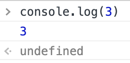
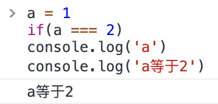
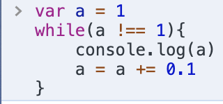
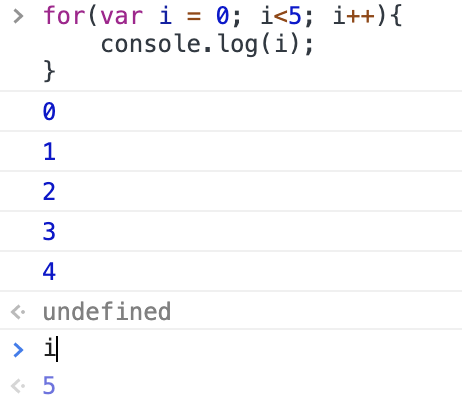
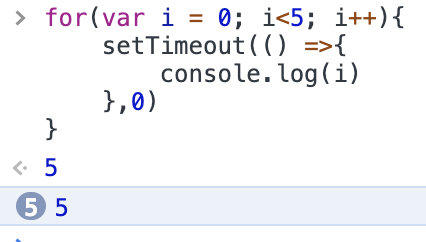

# JS 的基本语法
## 1.表达式和语句
  ### 表达式
  * `1 + 2 `表达式的值为3
  * `add(1,2)`表达式的值为函数的返回值
  
  ### 语句
  `var a = 1`是一个语句
  ### 区别
  * 表达式一般有值，语句可能有可能无
  * 语句一般会改变环境（声明、赋值）
  
  ### 大小写敏感，一定注意
  ### 空格
  * 大部分空格无意义
  * ⚠️return后不能加回车

## 2.标识符（用来命名）
`var a = 1;`
* 第一个字符可用unicode字母或_或$或中文
* 后面的字符，除了上面的，还可以数字

### 区块（block）
把代码包在一起
```
    {
        let a = 1
        let b = 2 
    }
```
常与if/for/while一起用

## if else 语句
### 语法
```
if(表达式){
    语句1
}else{
    语句2
}
```
### 变态情况
* 表达式变态：错误：`a=1`正确：`a ==== 1`
* 语句1变态：嵌套if else
* 语句2变态：同上
* 缩进变态：
  
### 使用没有歧义的写法
### switch 语句
#### 语法
```js
switch(fruit){
    case"banana":
    //...
    break;
    case"apple":
    //...
    break;
    default:
    //...
}
```
  * 省略break会有问题
  
  ### 问好冒号表达式
  `A ？B : c`

  ## while循环（当...时）
  ### 语法
  while（表达式）{
      语句
  }
  * 判断表达式为真，执行语句，执行完再判断；为假，结束
  ### 变态
  
  这是死循环，因为浮点数不精确，永远不会等于1

  ## for循环
  是while循环的方便写法
  ### 语法
  for(语句1；表达式2；语句3){
      循环体
  }
  
  ### 变态
   
   
 
* 先执行语句1，然后判断表达式2，如果为真，执行循环体，然后执行语句3；如果为假，直接退出循环。

## break 和 continue
* break：退出所有循环
* continue： 退出当前一次循环

## label语句
面试：
```
{ 
    foo:1
}
```
就是一个标签，是1