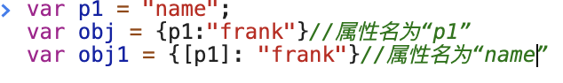

# JS 对象基本用法
## JavaScript 对象（Object）
### 写法
简单写法
```js
let obj = {
        "name":"frank","age":18 
}
```


```js

let obj = new Object({"name":"frank"}) //正规写法
```

### 注意
* 键名是字符串，不是标识符，可以包含任意字符
* 数字的时候，引号可省
* 就算引号省略，键名还是字符串（重要）

## 属性名
每个key都是对象的属性名（property）
### 变量做属性名

### 注意
* 不加[]的属性名会自动变为字符串
* 加了[]会当作变量求值
* 值如果不是字符串，会自动变成字符串

## 如何删除对象的属性
1. `delete obj.xxx`或者 `delete obj[xxx]`
可以删除obj的xxx属性
2. 查看一个属性名是否在对象
   `'xxx' in obj === false`obj对象里没有xxx属性
3. 有属性名，但是值为undefined
   `"xxx" in obj && obj.xxx === undefined`
4. `obj.xxx === undefined`
   不能判断xxx是否为obj的属性，只能判断属性值
## 如何查看对象的属性（读属性）
1. 查看自身所有属性
`Object.keys(obj)`
    查看属性值：`Object.values(obj)`
2. 查看自身+共有属性
    `console.dir(obj)`
3. 判断一个属性是自身的还是共有的
  `obj.hasOwnProperty("toString")`
## 如何查看对象的属性
* 两种方法
  1. 中括号法：`obj["key"]`
  2. 点语法：`obj.key`
### 注意
请使用第一种中括号法
* `obj.name`等价于`obj["name"]`这里name是字符串，不是变量
* `obj.name`不等于`obj[name]`中括号里那么是变量
## 修改或增加对象的属性
1. 直接赋值
   * `let obj = {name:"frank"}`//name是字符串
   * `obj.name = "frank"`//name 是字符串
   * `obj["name"] = "frank" `

2. 批量赋值
   `Object.assign(obj, {age: 19, gender: "man"})`

### 'name' in obj和obj.hasOwnProperty('name') 的区别
*  `'name' in obj`:属性名name是否在obj对象里
  
* `obj.hasOwnProperty('name')`
  判断属性name是obj对象自身的还是共有的


  