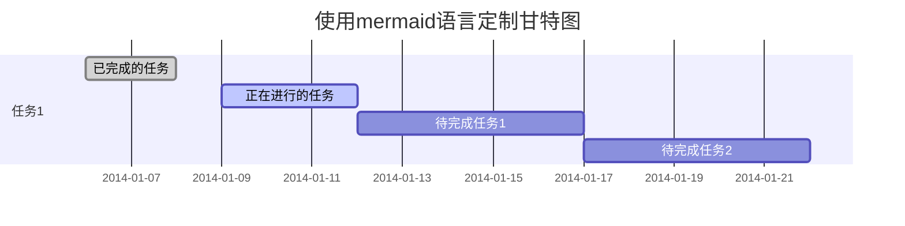
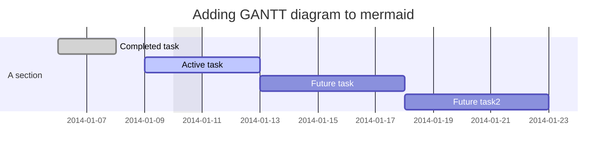
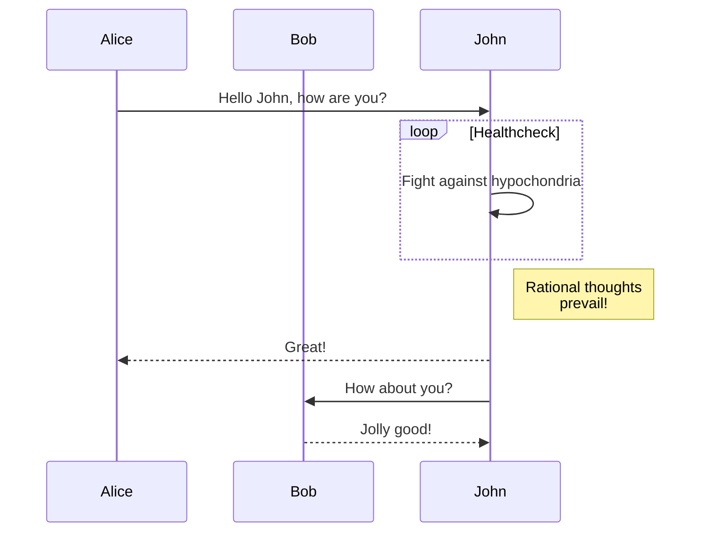
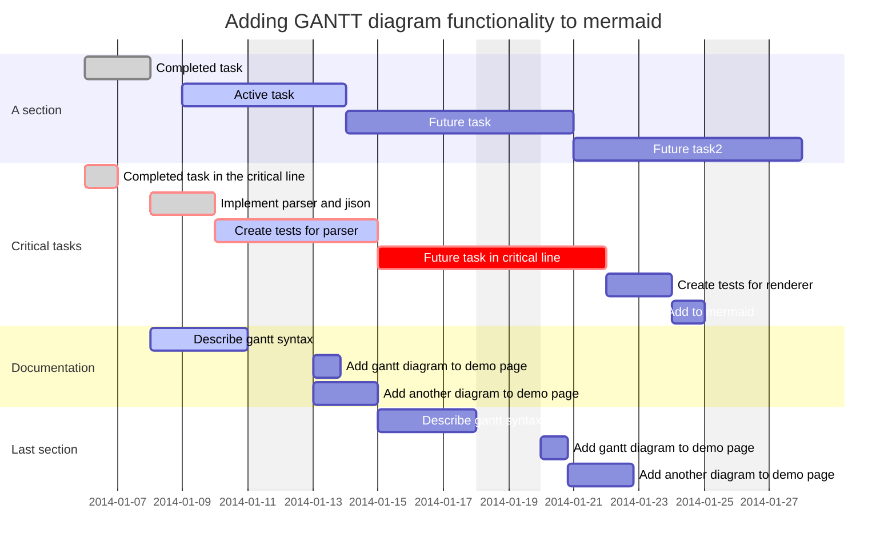

## markDown 语法

* 基本语法

* 表格语法

# `Markdown` 表格

## 基本表格

基本表格即标准分割的表格，无合并单元格等格式，规整的行列结构。

**基本表格语法：**

```markdown
|表头1|表头2|表头3|……|表头n|
|-----|-----|-----|-----|-----|
|列1|列2|列3|……|列n|
|列1|列2|列3|……|列n|
```

**实际效果：**

|表头1|表头2|表头3|……|表头n|
|-----|-----|-----|-----|-----|
|列1|列2|列3|……|列n|
|列1|列2|列3|……|列n|

**居中显示：**

```markdown
|表头1|表头2|表头3|……|表头n|
|:-----:|:-----:|:-----:|:-----:|:-----:|
|列1|列2|列3|……|列n|
|列1|列2|列3|……|列n|
```

**实际效果：**

|表头1|表头2|表头3|……|表头n|
|:-----:|:-----:|:-----:|:-----:|:-----:|
|列1|列2|列3|……|列n|
|列1|列2|列3|……|列n|


## 甘特图







