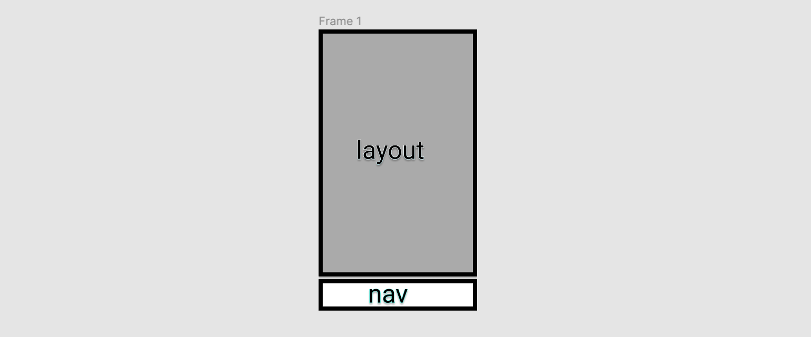

# 总体页面布局
用 Vue Router 进行页面切换路由管理，分别为**记账**、**标签**、**统计**页面，最后再加一个`404 页面`，之后用`Layout`组件让三个页面统一用布局，并且用`slot`插内容。
## Nav 组件
 `Vue Router` 写好路由
::: details router
```ts
import Vue from 'vue'
import VueRouter, { RouteConfig } from 'vue-router'
import Money from '../views/money.vue'
import Labels from '../views/labels.vue'
import Statistic from '../views/statistic.vue'
import NotFound from '@/views/NotFound.vue';
Vue.use(VueRouter)

  const routes: Array<RouteConfig> = [
    {
      path: '/',
      component: Money
    },
    {
      path: '/money',
      component: Money
    },

    {
      path: '/labels',
      component: Labels
    },
    {
      path: '/statistic',
      component: Statistic
    },
    {
      path: '*',
      component: NotFound
    },
]

const router = new VueRouter({
  routes
})

export default router

```
:::

实现导航栏，用`router-link`进行跳转
::: details Nav 组件
```vue
<template>
  <div>
    <router-link to="/money">记账</router-link>
    <router-link to="/labels">标签</router-link>
    <router-link to="/statistic">统计</router-link>
  </div>
</template>

<script lang="ts">
  import Vue from 'vue';
  import {Component} from 'vue-property-decorator';

  @Component
  export default class Nav extends Vue {

  }
</script>

<style lang="scss" scoped>

</style>
```
:::


## Layout 组件
布局图示:
`slot`插入三个页面
::: details Layout 组件
```vue
<template>
  <div class="nav-wrapper">
    <div class="content">
      <slot/>
    </div>
    <Nav/>
  </div>
</template>

<script lang="ts">
  import Vue from 'vue';
  import {Component} from 'vue-property-decorator';

  @Component
  export default class Layout extends Vue {

  }
</script>

<style lang="scss" scoped>
.nav-wrapper{
  border: 1px solid red;
  display: flex;
  flex-direction: column;
  height: 100vh;
  > .content{
    border: 1px solid green;
    overflow: auto;
    flex-grow: 1;
  }
}
</style>
```
:::