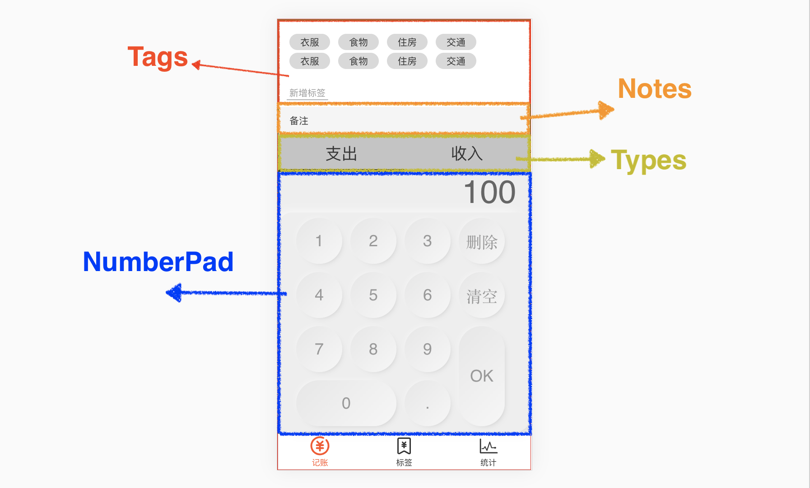

# 记账页面
页面视图：由4个组件构成，分别是`Tags`、`Notes`、 `Types` 、`NumberPad`


## Notes 组件
### v-model
当 input 里有`value` 和 `@input` 时，可以简写为 `v-model='x'`
```vue
<template>
  <div>
    <label class="notes">
      {{x}}
      <span class="name">备注</span>
      <input type="text" :value="x" @input="x=$event.target.value">
    </label>
  </div>
</template>

<script lang="ts">
  import Vue from 'vue';
  import {Component} from 'vue-property-decorator';

  @Component
  export default class Notes extends Vue {
    x = ''; //data
  }
</script>
```
## NumberPad 组件
### scss 样式
* 用新拟态制作的按钮样式
  精髓在 button 的 `background` 、`box-shadow`
* 用 grid 布局

::: details NumberPad scss
```vue
 <template>
  <div class="numberPad">
    <div class="output">{{output}}</div>
    <div class="buttons">
      <button style="grid-area: number-1" @click="inputContent">1</button>
      <button style="grid-area: number-2" @click="inputContent">2</button>
      <button style="grid-area: number-3" @click="inputContent">3</button>
      <button style="grid-area: number-d" @click="remove">删除</button>
      <button style="grid-area: number-4" @click="inputContent">4</button>
      <button style="grid-area: number-5" @click="inputContent">5</button>
      <button style="grid-area: number-6" @click="inputContent">6</button>
      <button style="grid-area: number-s" @click="clear">清空</button>
      <button style="grid-area: number-7" @click="inputContent">7</button>
      <button style="grid-area: number-8" @click="inputContent">8</button>
      <button style="grid-area: number-9" @click="inputContent">9</button>
      <button style="grid-area: number-o" @click="ok">OK</button>
      <button style="grid-area: number-0" @click="inputContent">0</button>
      <button style="grid-area: number-p" @click="inputContent">.</button>
    </div>
  </div>
</template>


<style lang="scss" scoped>
  .numberPad {
    background-color: #eee;
    .output {
      font-size: 48px;
      font-family: Helvetica,serif ;
      padding: 0 20px;
      text-align: right;
      color: #666;
      line-height: 60px;
    }
    .buttons {
      $button-width:80px;
      $button-height:80px;

      display: grid;
      grid-template-areas:"number-1 number-2 number-3 number-d"
      "number-4 number-5 number-6 number-s"
      "number-7 number-8 number-9 number-o"
      "number-0 number-0 number-p number-o";
      grid-template-columns: repeat(4,$button-width);
      grid-template-rows: repeat(4,$button-height);

      box-shadow: -8px -8px 16px -10px rgba(255,255,255,1),8px 8px 16px -10px rgba(0,0,0,0.15);
      padding: 2px 20px;
      border-radius: 20px;
      > button {
        margin: 6px;
        padding: 0;
        border: 0;
        display: block;
        outline: none;
        border-radius: calc(80px/2);
        font-size: 24px;
        font-family: Helvetica,serif;
        font-weight: normal;
        color: #999999;
        background: linear-gradient(135deg,rgba(230,230,230,1) 0%,rgba(246,246,246,1) 100%);
        box-shadow: -4px -4px 10px -8px rgba(255,255,255,1),4px 4px 10px -8px rgba(0,0,0, 0.3);
        border: none;
        &:active{
          box-shadow: -4px -4px 10px -8px rgba(255,255,255,1) inset ,4px 4px 10px -8px rgba(0,0,0, 0.3) inset;
          border: none;
        }
      }
    }
  }
</style>
```
:::