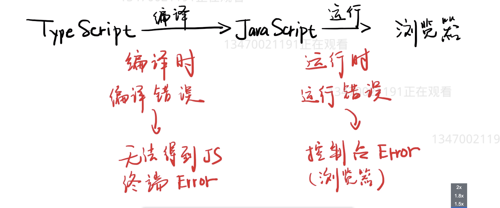

# TypeScript
`@Prop(Number) xxx: number | undefined;`

* Prop 告诉Vue ， `fuck` 不是data 而是 prop
* Number 告诉 Vue，`fuck` 运行时是个number
* `fuck` 是属性名
* number 和 undefined 告诉 Ts ， fuck 的编译时类型
### TypeScript 编译过程

## JS 与 TS 对比 （在 Vue 中）
::: details JS
```js
<script>
  export default {
    name:'Types'
    props:['fuck'],
    data(){
        return{
            type = '-';
        }
    }
    
    selectedType(type){
      if(type !=='-' && type !== '+'){
        throw new Error('type is unknown')
      }
      this.type=type;
    }
    mounted(){
      console.log(this.fuck);
    }
  }
</script>
```
:::

::: details TS
```ts
<script lang="ts">
  import Vue from 'vue';
  import {Component, Prop} from 'vue-property-decorator';
  @Component
  export default class Types extends Vue{
    @Prop(Number) fuck: number | undefined;
    type = '-';

    selectedType(type: string){
      if(type !=='-' && type !== '+'){
        throw new Error('type is unknown')
      }
      this.type=type;
    }

    mounted(){
      console.log(this.fuck);
    }
  }
</script>
```
:::

## 写 Vue 组件的三种方式 （单文件组件）
1. 用 JS 对象
   ```js
    export default{
        data(){},
        props:{},
        methods:{},
        mounted:{}
    }
   ```
2. 用 TS 类
   ```ts
   <script lang=ts>
   @Component
   export default class XXX extends Vue{
       fuck: string = 'hi'; //data
       @Prop(Number) xxx: number| undefined;
       open(){}; //method
       mounted(){};
   }
   </script>
   ```
3. 用 JS 类
   ```js
   <script>
   @Component
   export default class XXX extends Vue{
       fuck = 'hi'
   }
   </script>
   ```