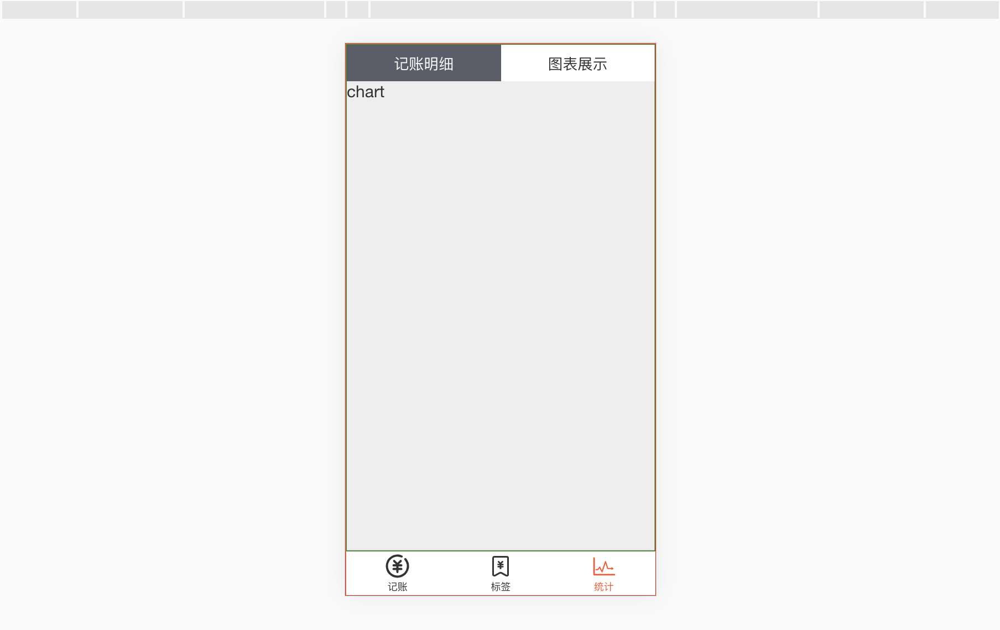

# 统计页面
总体分为两个子页面，用`vue Router` 切换

## 切换子界面 
代码
::: details vue
```js
//主页面 statistic
 <template>
  <Layout>
    <div>
      <statistics-nav></statistics-nav>
      <div class="content">
        <slot/>
      </div>
    </div>
  </Layout>
</template>

//statistics-nav 组件
<template>
  <div class="nav">
    <router-link to="/statistic/details"  class="nav-item" active-class="selected" exact>
      记账明细
    </router-link>
    <router-link to="/statistic/chart" class="nav-item" active-class="selected">
      图表展示
    </router-link>
  </div>
</template>

//子页面 chart || details
<template>
      <statistic>
            <div>chart</div>
      </statistic>
</template>
```
:::

### 遇到问题
在路由里加了两个新路径
```js
    {
      path: '/statistic/details',
      component: Details
    },
    {
      path: '/statistic/chart',
      component: Chart
    },
```

然后，发现需要设置一个默认路径，在统计页面里直接跳到其中一个子页面，试了很多方法，比如设置`children+redirect`,最后还是用重定向，是从 `/a `重定向到 `/b`:
 ```ts
   {
      path: '/statistic',
      component: Statistic,
      redirect: '/statistic/details'
    },
   ```

## 记账明细页面
这个页面主要是收集数据，将其展示出来
::: details 代码
```js
 recordList = recordModel.fetch() //拿到数据

    //将tags：['衣服'] => 衣服
     tagString(tags){
       return tags.length===0 ? '无':tags.join(',')
     }

     //result('-','day')
    result(type, time){
      let daily=0;
      let monthly=0;
      const now = dayjs();
      const {recordList} = this;
      const newList=JSON.parse(JSON.stringify(recordList)).filter(r=>r.type===type);

      for(let i=0;i<newList.length;i++){
        if(now.isSame(dayjs(newList[i].date),'day')){
          daily+=newList[i].totalNumber;
        }
        if(now.isSame(dayjs(newList[i].date),'month')){
          monthly+=newList[i].totalNumber;
        }
      }
      if(time==='day'){return daily;}
      if(time==='month'){return monthly;}
    }

```
:::

### 时间格式化
::: details 代码
```js
//beautify("2020-07-03T08:03:09.705Z")
 beautify(string) {
      const day = dayjs(string);
      const now = dayjs();
      if (day.isSame(now, 'day')) {
        return '今天  '+day.format('HH:mm');
      } else if (day.isSame(now.subtract(1, 'day'), 'day')) {
        return '昨天  '+day.format('HH:mm');
      } else if (day.isSame(now.subtract(2, 'day'), 'day')) {
        return '前天  '+day.format('HH:mm');
      } else if (day.isSame(now, 'year')) {
        return day.format('M月D日  HH:mm');
      } else {
        return day.format('YYYY年M月D日  HH:mm');
      }
    }
```
:::

### 遇到的问题
数据都可以展示出来后，发现我的记账明细页面需要点击刷新，才能更新新增数据，在网上找解决方法，一开始以为vue router 的原因，找一些自动刷新页面的方法，后来发现这条路走不通怀疑是本地数据存储问题，之后发现果然是全局数据管理的问题。
* 一开始，没有声明`data`，声明后，还是不同步。
* 在`details` 组件里直接拿数据，然后解决了。

::: details 代码
```js
const recordModel ={
  data:[],
  //
  fetch(){
    this.data=JSON.parse(window.localStorage.getItem('recordList')||'[]' )
    return this.data
  },
  //
  create(record){
    const newRecord = JSON.parse(JSON.stringify(record)) //克隆
    newRecord.date = new Date().toISOString() //添加的日期转成ISO8601；
    this.data.push(newRecord)
    this.save()
  },
  //
  save(){
    window.localStorage.setItem('recordList',JSON.stringify(this.data))
  }
}
export default recordModel

```
:::

